# 准备工作：Python
做美食需要准备锅碗瓢盆，作料和食材等。那写代码需要准备什么呢？只需要准备以下几样东西，其中1，2，3是必备，后面的看着办。
>1. [硬件] 电脑一台，能上网
>2. [软件] Visual Studio Code (免费)
>3. [软件] Python3.7 (免费)
>4. [软件] MS Office(收费)，金山WPS(免费)和LibreOffice(免费) (任选一项)
>5. [软件] Chrome(免费) (可选)
>6. [账户] 百度大脑账户(可选)
>7. [认知] 运用代码解决问题，人人都能学会

*下载地址见附录*


### Visual Studio Code
Visual Studio Code，简称VS Code。
VS Code是微软出品的一款优秀的，可以免费使用的代码编辑器。
我们在代码编辑器中写代码，调试代码，运行代码。

啥是代码？代码就是我们人类向电脑发出的指令。只要你向电脑下达指令，电脑就会无条件执行。那代码编辑器就是你制定指令，发出指令的地方。


### Python3.7


Python是一门优秀的，被广泛应用的编程语言。同时它也是可以免费使用的。

啥是编程语言？编程就是写代码，而代码就是指令，所以编程又可以理解为写指令，发指令。而语言是一种沟通方式，所以编程语言，可以理解为用指令和电脑进行沟通的方式，或者更直接一点，**编程语言就是给电脑下达指令的方式。**

Python同时是人类和电脑之间的翻译。一个是语言，一个是翻译，为啥不取两个不同的名字呢？这就好比，English既有“英语”的意思，又有“英格兰的”的意思，它们是同一个道理。

代码的基本元素有英文单词，数字，数字符合和标点符合等。指令按我们人类的语言习惯编写的，但电脑理解不了用人类语言编写的指令，这时候就需要有人它将翻译成电脑能理解的二级制指令。谁来翻译呢？还是由python来翻译。

计算机编程语言有许多种，Python只是其中的一种。之所以选择它，主要基于以下两个特点：
>1. 容易理解，上手快；
>2. 功能强大，应用广；


### MS Office，金山WPS和LibreOffice
常见的办公软件有MS Office，金山WPS和LibreOffice等。根据个人的习惯和喜好选择即可。

办公软件是常用的信息处理工具。比如word格式的文件，excel格式的文件，powerpoint格式的文件，在我们的办公电脑中比比皆是，这些文件记录着我们的工作。它可以帮我们沉淀知识和经验，它也可以帮我们发现新的问题。


### Chrome
互联网是一个巨大无比的信息库，而浏览器是重要的互联网信息获取工具。Chrome是谷歌开发的一款浏览器。界面简洁，无广告，无干扰信息。自带翻译功能，翻译质量高，获取信息无语言障碍。


### 百度大脑账户
AI时代已经到来了，运用代码我们就能轻而易举地调用云计算服务解决以前觉得不太可能解决的问题，比如文字识别，表单识别，人脸识别等等。因此，除了可以让电脑成为我们的助手，还可以让云计算服务也成为我们的助手。

以云计算服务的形式向用户提供AI能力的产品有很多，百度是其中之一。想要使用这些能力，首先需要注册一个账号。这些能力虽然不是完全免费使用，但大部分能力都提供了一定量的免费额度。详情可访问[百度大脑官网](https://ai.baidu.com/?blank)。


### 运用代码解决问题，人人都能学会
一提到编程，许多人会联想到操作系统，算法，编译原理等这些专业知识。似乎这些专业知识是学习编程的前提。

事实上，编程的本质是解决问题。需要多少专业知识，取决于你要解决的问题。好比你想学造汽车，那就需要学习很多门专业知识；如果你只想学会开车，以车代步，那就完全不需要学习造车的专业知识，只需要练习开车就够了。

同理，你想通过编程给电脑发送指令，让电脑完成指定的任务。这种情况，编程和打游戏，在本质上是一样的，只不过操作方式不同而已。


---
### 附录
#### 1. 软件下载地址
软件|官网下载地址|支持的操作系统
--|--|--
Visual Studio Code|[https://code.visualstudio.com/Download](https://code.visualstudio.com/Download?blank)| Windows,Mac,Linux
Python3.7|[https://www.python.org/downloads/](https://www.python.org/downloads/?blank)|Windows,Mac,Linux
MS Office|[https://www.office.com/](https://www.office.com/?blank)|Windows,Mac
WPS|[https://www.wps.cn/](https://www.wps.cn/?blank)|Windows,Mac,Linux
LibreOffice|[https://zh-cn.libreoffice.org/download](https://zh-cn.libreoffice.org/download/?blank)|Windows,Mac,Linux
Chrome|[https://www.google.cn/chrome/](https://www.google.cn/chrome/?blank)| Windows,Mac,Linux

> 两个小提示：
>
> 1. 为安全起见，以上两个软件最好直接从官网下载安装。
> 2. 尽量使用默认安装项，安装在默认的位置。

### 2.软件安装与使用

***
#### python
1、下载python。

点击 [https://www.python.org/downloads/](https://www.python.org/downloads/?blank)，打开python官网下载网页，点击网页中部的黄色按钮“Download Python 3.7.4”下载安装文件到电脑中。*(3.7.4是最新的python版本号，在你打开这个页面的时候，版本号可能发生了变化)*

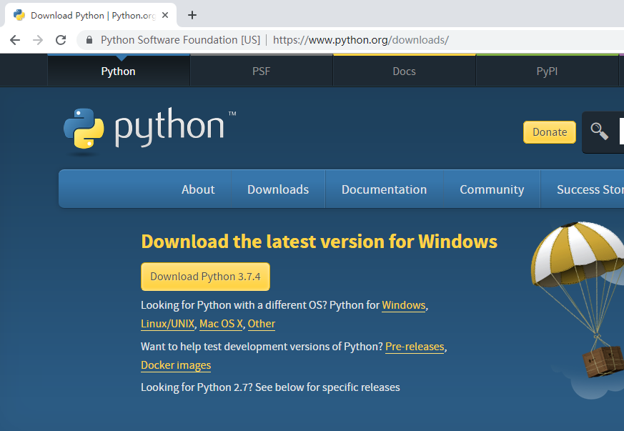

2、安装python。(以windows为例)

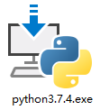

双击刚刚下载的python安装文件，在安装界面中，勾选<font  color=#ff0000>"Add python3.7 to PATH"</font>，然后点 <font  color=#ff0000>"Install Now"</font>开始安装。

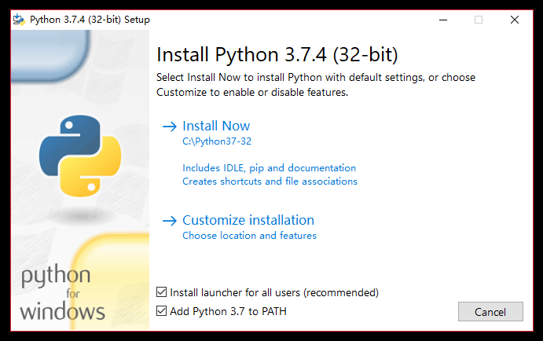


3、验证python是否正确安装(以windows为例)

在键盘上同时按下 "windows键" 和 字母"r" (windows键通常在alt键旁边，印有window旗帜图标)，系统弹出“运行”对话框。

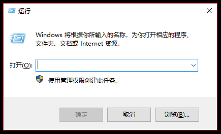

在“运行”对话框中，输入 “<font  color=#ff0000>cmd</font>”。按回车后，系统弹出“命令行”窗口。

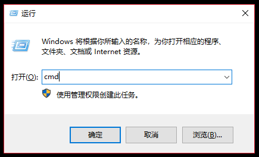

下图就是“命令行”窗口

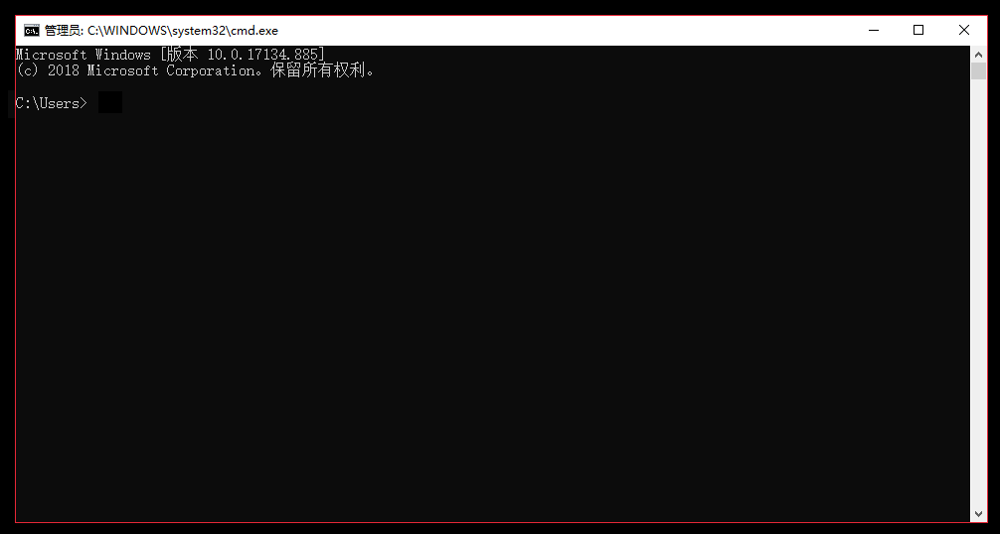

在命令行中输入

```shell
python -V
```
命令行显示
```shell
Python 3.7.4
```
说明安装成功了。*(3.7.4为python的版本号，安装的版本不一样，显示的版本号也不一样)*

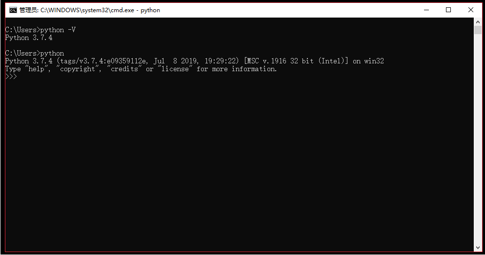

***

#### VS Code
1、下载VS Code

点击 [https://code.visualstudio.com/Download](https://code.visualstudio.com/Download?blank) ，打开VS Code官网下载网页，点击网页中绿色的按钮"Download for Windows"，（如果用苹果电脑访问这个页面，按钮上的字变成了"Download for Mac"，网页会自动识别跟操作系统匹配的版本），等待VS Code安装包下载完成。

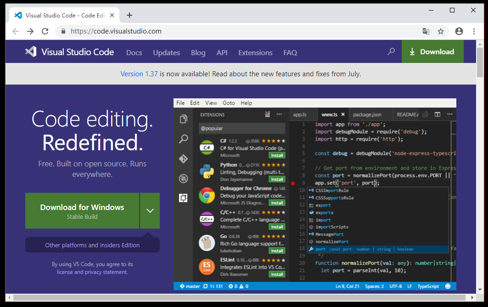

2、安装VS Code

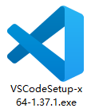

双击VS Code安装文件图标，根据每一步的提示，完成安装即可。


3、VS Code初体验

第一次启动VS Code，大家会看到欢迎页，如下图。

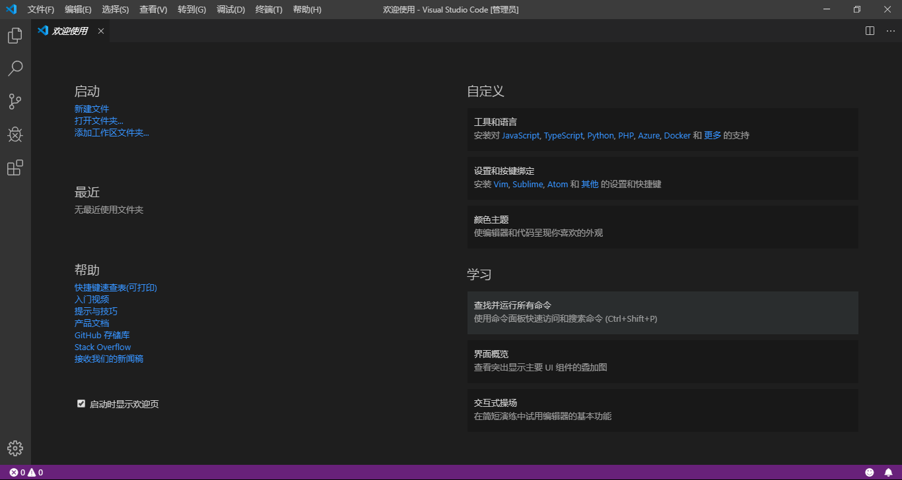

点击左边工具栏中的资源管理器(下图箭头所指)，

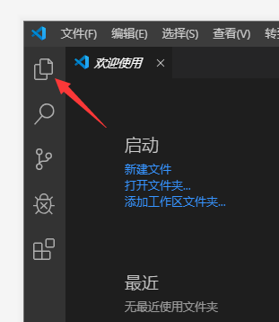

在资源管理器中，点击“打开文件夹”，选择文件夹。接下来我们新建的文件，将保存在这个文件夹中。

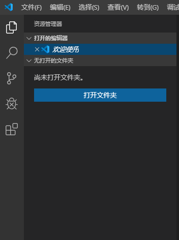

在"资源管理器"空白处右键鼠标，弹出快捷菜单
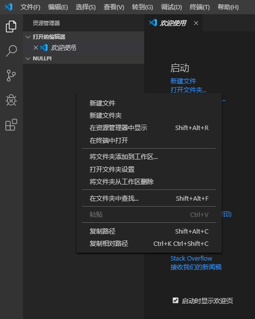

点“新建文件”，新建"hello.py"文件。
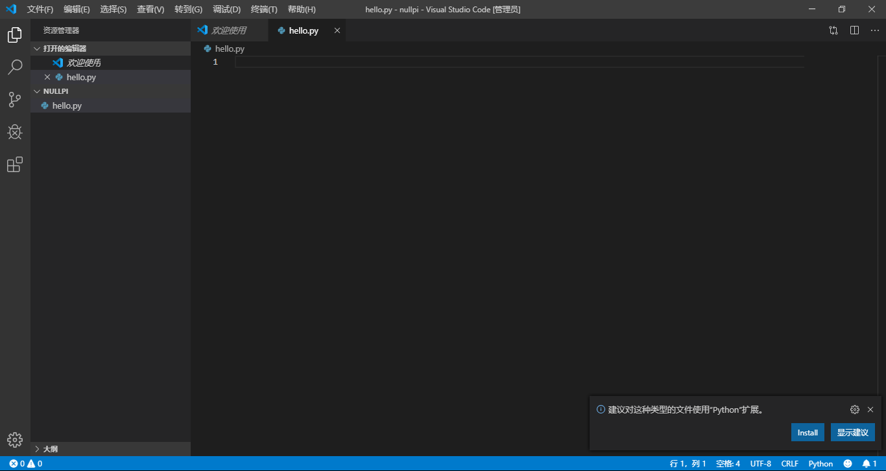

右下角，VS Code建议“python扩展”,点击Install安装

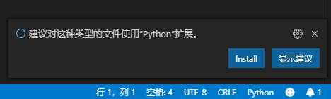

在python.py文件中，输入
```python
print('hello python')
```
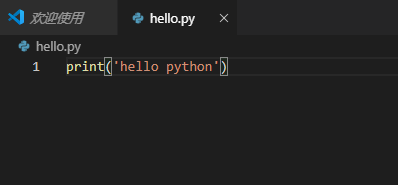


点击 菜单“终端(T)->新建终端(Ctrl+Shift+`)”

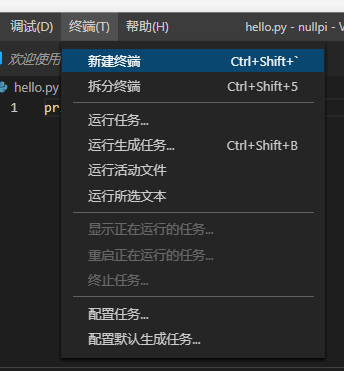

在下方新出现的窗口就是终端

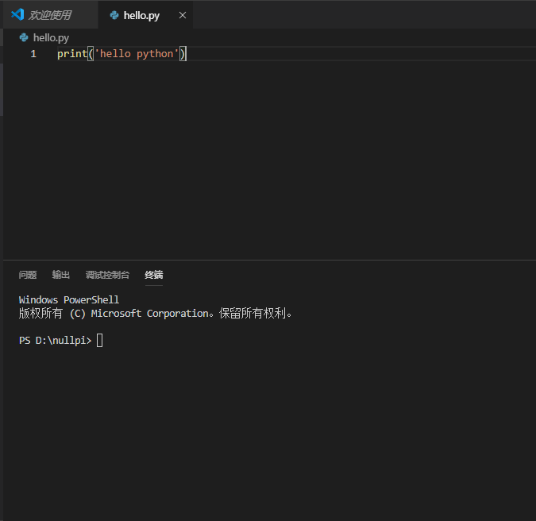

在终端中输入以下命令，运行python程序
```shell
python hello.py
```
按下回车键之后，终端立马显示 hello python。说明运行成功，并输出了正确的值。

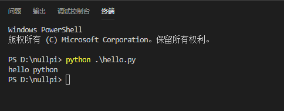

> 命令行小提示
> 使用tab键，自动补全
> 比如敲完h之后，按tab键，hello.py自动补全了。

VS Code虽然上手容易，但是它的功能十分丰富，希望它能成为大家最喜欢的代码编辑器。

