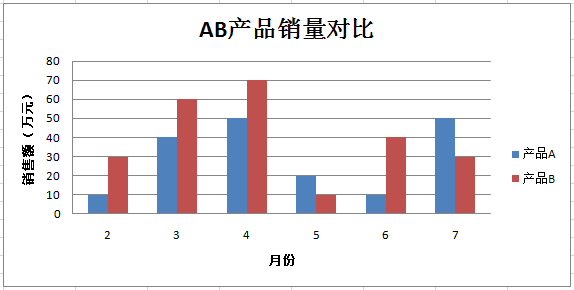
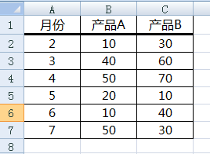

# 代码与数据三剑客：**表格**，**表单**和图表

**表格**，**表单**和**图表**乃数据三剑客。它们仨是数据收集，数据存储，数据展示的好手。数据收集，存储和展示也是信息系统的三大基础功能。之所以能在Excel的基础上构建信息系统，就是因为Excel提供了这三大基础功能。

### 表格 ###

表格是一个由N行M列构成的二维表。Excel中的工作表就是一个二维表格。通常用一张表格记录同一类事物的数据，表中的每一行记录某一个事物的数据，表中的每一列记录事物的一个**属性**值。

比如，我们用一张工作表记录员工的基本信息，每一行记录一个员工的信息。每一列代表员工的属性，比如姓名，性别，职位，入职日期等等。

| 姓名 | 性别 | 职位     | 入职日期 |
| ---- | ---- | -------- | -------- |
| 张三 | 男   | 行政秘书 | 2019-9-3 |
| 李四 | 男   | 财务助理 | 2019-9-4 |
| 王五 | 女   | 销售顾问 | 2019-9-5 |
| 赵六 | 女   | 销售顾问 | 2019-9-6 |


这样的一张表格，用Python怎么表示呢？可以用**列表**数据结构。列表用方括号将元素括起来，元素用逗号隔开，比如 ['张三', ‘男’, '行政秘书', '2019-9-3']。我们可以用一个列表来表示表格中的一行数据，里面的元素对应表格中的列。如何表示多行数据呢？列表嵌套，将列表作为另一个列表的元素。如下所示。

```python
[
    ['张三', '男', '行政秘书', '2019-9-3'],
    ['李四', '男', '财务助理', '2019-9-4'],
    ['王五', '女', '销售顾问', '2019-9-5'],
    ['赵六', '女', '销售顾问', '2019-9-6']
]
```


下面以员工表为例，介绍一下列表的基本操作。

**创建列表**

```python
employees = []
```

员工表employees是一个变量，变量的类型是列表，用方括号表示。方括号里没有数据项，表示这是一个空的列表。


**添加元素**

```python
people = []
people.append('张三')
people.append('男')
people.append('行政秘书')
people.append('2019-9-3')
```

也可以这样添加元素

```python
people = ['张三', '男', '行政秘书', '2019-9-3']
```

还可以将一个列表添加到另一个列表

```python
employees.append(people)
```


**修改元素**

比如如何将 people 中的 '2019-9-3' 改成 '2018-5-1'。

```python
people[3] = '2018-5-1'
```

people[3] 里的 3 是列表元素的索引值。索引从 0 开始计算。所以，people[0] 是 '张三'，people[1]  是'男'，以此类推，people[3] 是 '2019-9-3'。给元素赋一个新的值，完成对元素的修改。


**删除元素**

```python
del people[3]
```

del是python基本语句，删除people列表中，索引值为3的元素。


---

### **表单**

大家经常和表单打交道，只是不知道它有一个名字叫表单。

例如寄快递，需要填一个单子，不管这单子是在手机填还是在电脑上填，这个单子的本质就是一个表单。它的作用是收集数据。可以把表单收集的数据简单地理解为表格中的一行数据。快递公司的数据保存在数据库中，数据库由一张张表构成，表也是二维表。只是数据库的和Excel的定位不同而已。

再例如，你有一个10人的销售团队，可使用表单来收集和共享有关销售的信息。 然后将这些表单中的数据合并到一个汇总报表中，并且每个月发给管理层一次。

表单就是一个收集数据的工具。表单工具有许多，比如Office Infopath，WPS表单，Google表单等。这些表单工具收集到的数据通常最终保存在电子表格中。以表单加电子表格的方式可以构建出行之有效的信息管理工具。比如管理销售数据，管理客户数据。它的优点是能快速满足个性化业务需求，成本低，实施容易。它的缺点是单个电子表格保存几千上万条数据没问题，数据再多了就得使用数据库了。

当业务趋向成熟稳定后，企业通常会购买通用的管理系统来管理业务，比如客户关系管理，财务管理，供应链管理系统等。这些系统使用数据库存储数据。用户不可以直接操作数据库，用户使用各种表单，在严格的规范下使用数据。各个模块下的添加功能，本质上就是表单。比如添加新用户，它就是一个收集新用户信息的表单。

当业务还处于创新阶段，在这个阶段使用通用的管理系统往往效果不太好。原因在于这个阶段的业务在不断调整中，流程在不断调整中，数据的关系也在不断调整中。这时候，把表单的范畴扩大，不管是写在纸上的，还是第三方的单据，或者是其它的什么数据，不拘泥于窗体表单的形式，统统视为表单。用代码或者人工的方式写到电子表格中，最后合并到一起。这种方式灵活，能快速满足个性化需求。这段半自动的经历能让你深刻地明白未来你需要什么样的系统。

表单是数据收集工具，但不要仅限于一种形式。


---

### 图表

图表是一种信息表达的工具。数据中包含有信息，从不同的角度观察，可以得到不同的信息，得到不同的见解。图表工具有许多，Excel自带图表工具就是其中之一。

下面使用openpyxl包中的chart模块，在工作表中添加柱形图。要实现的柱形图如图所示：





这张柱形图对2月份到7月份，A，B两个产品销售额做一个对比。

柱形图由图表标题，水平(分类)轴标题，垂直(值)轴标题，图例项(系列)和数据等组成。


柱形图的数据如下：



第一行为各行数据的标题，第2行~第7行每一行表示产品A和产品B当月的销售额。


完整代码如下：

```py
from openpyxl import Workbook
from openpyxl.chart import BarChart, Series, Reference

wb = Workbook()
ws = wb.active

rows = [
    ['月份', '产品A', '产品B'],
    [2, 10, 30],
    [3, 40, 60],
    [4, 50, 70],
    [5, 20, 10],
    [6, 10, 40],
    [7, 50, 30],
]

for row in rows:
    ws.append(row)

chart1 = BarChart()
chart1.type = "col"


chart1.title = "AB产品销量对比"
chart1.y_axis.title = '销售额（万元）'
chart1.x_axis.title = '月份'

data = Reference(ws, min_col=2, min_row=1, max_row=7, max_col=3)
cats = Reference(ws, min_col=1, min_row=2, max_row=7)
chart1.add_data(data, titles_from_data=True)
chart1.set_categories(cats)

ws.add_chart(chart1, "B10")

wb.save("bar.xlsx")
```

[源代码](src/example-bar-ab.py)


```python
from openpyxl import Workbook
from openpyxl.chart import BarChart, Series, Reference

wb = Workbook()
ws = wb.active
```

这段代码大家已经很熟悉了。从有关的包中引用所需的模块。然后实例化工作簿对象，选择默认的工作表。


```python
rows = [
    ['月份', '产品A', '产品B'],
    [2, 10, 30],
    [3, 40, 60],
    [4, 50, 70],
    [5, 20, 10],
    [6, 10, 40],
    [7, 50, 30],
]
```

用列表嵌套结构记录二维表格数据。列表里的每一个列表记录一行数据。里边的列表中的每一个元素，对应一个单元格中的值。


```python
for row in rows:
    ws.append(row)
```

循环取出二维表格中的每一行数据，并逐行添加到工作表中。


```python
chart1 = BarChart()
```

实例化柱形图对象，赋给变量chart1


```python
chart1.type = "col"
```

设置chart1的type属性，当值为 "col" 时，为垂直柱形图，当值为 "*bar*" 时，为水平柱形图。


```python
chart1.title = "AB产品销量对比"
chart1.y_axis.title = '销售额（万元）'
chart1.x_axis.title = '月份'
```

分别设置图表标题，垂直(值)轴标题和水平(分类)轴标题。


```python
data = Reference(ws, min_col=2, min_row=1, max_row=7, max_col=3)
```

给图表指定数据。实例化Reference赋给变量data。第一个参数值指定数据所在的工作表，min_col指定数据从那一列开始，min_row指定数据从那一列开始，max_row指定数据到那一行结束，max_col指定数据到那一列结束。这和在Excel中用鼠标给图表选择数据的思路是一样。


```python
cats = Reference(ws, min_col=1, min_row=2, max_row=7)
```

给图例项(系列)指定数据。再实例化Reference赋给变量cats。第一个参数值指定数据所在的工作表，min_col指定数据所在的列。min_row指定数据从那一列开始，max_row指定数据到那一行结束。这和在Excel用鼠标给图表选择图例项(系列)的思路是一样。


```python
chart1.add_data(data, titles_from_data=True)
chart1.set_categories(cats)
```

将 data 和 cats 两项数据添加到柱形图对象中。


```python
ws.add_chart(chart1, "B10")
```

将柱形图对象添加到工作表的"B10"位置。


```python
wb.save("bar.xlsx")
```

将工作簿保存到"bar.xlsx"文件中。


openpyxl支持的图表非常丰富，有条形图，柱形图，气泡图，线图，散点图，饼状图，甜甜圈图表，雷达图表，股票图表和曲面图等等。在代码中使用它们的思路和使用柱形图基本一致，详情请参考[官方文档](https://openpyxl.readthedocs.io/en/stable/charts/introduction.html)。


### 小结

---

结构化的数据通常用二维表格的形式保存。数据量少的通常用Excel这类的工具保存。数据量再大一些，通常使用关系型数据库保存，常见的关系型数据库有Mysql，SQL Server，Oracal等等。

表单用于收集数据。表单的形式不要拘泥于我们熟悉的窗体表单。纸质票据，甚至传感器都是一种表单形式。

表单收集数据，二维表格存储数据。收集和存储的目的是为了使用数据。从数据中获得新的观点，见解，得出结论，图表是一个常用的工具之一。

