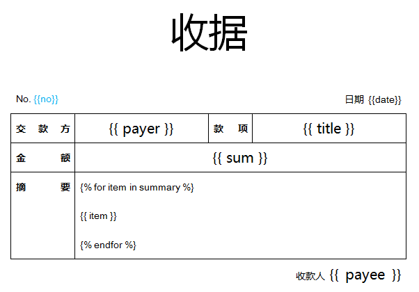
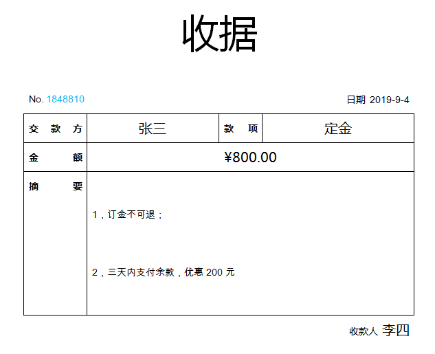

# 代码与docx：新建，打开，替换和合并文件

docx是微软word 2007以后的文件格式。word2007之前的文件格式为doc。Word也成了工作中的必备软件，docx文件也是一个重要的数据来源。如果说Excel处理的数据以数字为主，那么Word处理的数据则以文本为主。Excel以二维表格的结构来组织数据，Word以段落结构来组织数据。下面我们按一贯的风格，先上代码，然后逐行阅读代码的方式，从代码的角度来了解Python是如何操作docx文件的。


### 新建word文件

---

用python代码新建一个docx文件，文件里有一行字“你好，Python” 。

```python
from docx import Document
document = Document()
document.add_paragraph('你好，Python')
document.save('新建docx文件.docx')
```

*([源文件](src/example-docx-1.py))*

Python操作docx文件可以使用python-docx库。所以需要使用pip命令安装python-docx。

```shell
pip install python-docx
```


```python
from docx import Document
```

需要使用哪个模块就得先引用哪个模块。引用功能模块使用 from ... import ... 语句，即从某个包中引用某个模块。


```python
document = Document()
```

实例化Document类，生成Document对象，讲对象赋给变量document。Document就是Word中的文档。


```python
document.add_paragraph('你好，Python')
```

调用文档对象中的add_paragraph方法，在文档中添加一个段落，内容是“你好，Python”。


```python
document.save('新建docx文件.docx')
```

将文档保存为“新建docx文件.docx”。


### 打开word文件

---

用python代码打开上一个例子新建的docx文件，并在屏幕中打印段落中的文本。


```python
from docx import Document

document = Document('新建docx文件.docx')
for paragraph in document.paragraphs:
    print(paragraph.text)
```

*（[源代码](src/example-docx-2.py)）*


```python
document = Document('新建docx文件.docx')
```

实例化Document的时候，如果不传参数，则新建一个docx文件，如果传入一个已存在的docx文件路径，则打开它。


```python
for paragraph in document.paragraphs:
    print(paragraph.text)
```

document.paragraphs表示文档中的所有段，它的数据类型为列表。所以可以使用 for循环语句将它们逐个取出来。段落中的文本保存在 paragraph 的 text 属性中。用print函数将paragraph.text打印在屏幕上。


### 模板替换

---

假设有这样的一个[收据模板](src/收据模板.docx)，文件格式为docx，如下图所示：



{{ ... }} 是变量标签。假如变量payer的值为 “张三” , {{ payer }} 被替换成 “张三”。替换后保留便签的字体颜色等格式。

\{% ... %\} 是标签语句。\{% for item in summary %\}  意思是从 summary 序列中，循环取出其中的元素，并把元素赋给变量 item。\{% endfor %\} 意思是循环结束。


如何用代码将标签替换成对应的数据呢？先上源代码。


```python
from docxtpl import DocxTemplate

doc = DocxTemplate("收据模板.docx")
context = { 
                    'no' : '1848810', 
                    'date' : '2019-9-4', 
                    'payer' : '张三', 
                    'title' : '定金', 
                    'sum' : '¥800.00', 
                    'summary' : ('1，定金不可退；', '2，三天内支付余款，优惠200元'), 
                    'payee' : '李四'
                }
doc.render(context)
doc.save("一张收据.docx")
```

*([源代码](src/example-docx-3.py))*


需要使用docxtpl包，首先使用pip安装它。

```shell
pip install docxtpl
```


```python
doc = DocxTemplate("收据模板.docx")
```

实例化DocxTemplate类，将对象赋给doc变量。参数为模板文件的路径 "收据模板.docx"。


```python
context = { 
                    'no' : '1848810', 
                    'date' : '2019-9-4', 
                    'payer' : '张三', 
                    'title' : '定金', 
                    'sum' : '¥800.00', 
                    'summary' : ('1，定金不可退；', '2，三天内支付余款，优惠200元'), 
                    'payee' : '李四'
                }
```

准备模板标签所需的数据。{ ’键‘ : '值' } 这是字典数据结构。数据用大括号括起来，数据项之间用逗号隔开，每一个数据项由键名和键值组成，用冒号隔开。键名需要用引号引起来。

context中的键名和docx中的标签同名。docx中  {{ payer }} 的值就是 context['payer ']的值，即“张三”。


> 通过键名来访问字典中的数据，比如context['summary'] 获得数据项 ’summary‘ 的值。
>
> ’summary‘ 的值用圆括号括起来，这种数据结构叫元组。元组的数据项之间也是用逗号隔开。
>
> 列表，元组，字典是Python内置的三种数据结构。它们的元素都可以使用for语句循环取出。
>
> |      | 形式                            | 特点                                                         |
> | ---- | ------------------------------- | ------------------------------------------------------------ |
> | 列表 | [元素, ... , 元素]              | 通过索引号访问元素，比如 a = [1,2,3]，a[0]的值为1            |
> | 元组 | (元素, ... , 元素)              | 只能读，不可以修改                                           |
> | 字典 | {’键‘ : '值', ..., ’键‘ : '值'} | 通过键名访问，比如 a = { 'title' : '定金'}，a['title']的值为'定金' |


```python
doc.render(context)
```

将准备好的模板数据通过render方法的传给模板，并完成替换。


```python
doc.save("一张收据.docx")
```

将替换掉标签的模板保存成一个新文件，文件名为"一张收据.docx"。


运行代码，生成文件"一张收据.docx"，用word打开它，结果如下：




### 合并word文件

---

假设你对每一项业务都做了总结和整理，每一个业务介绍单独保存在一个docx文件中，业务的处理办法也单独保存在docx文件中。如果你在培训结束后，需要出一份试卷检查一下培训成果，那么可以使用文件合并的方式来实现。下面举一个例子，演示如何将文件1和文件2，合并成一个新的文件。先看代码：


```python
from docxcompose.composer import Composer
from docx import Document

doc1 = Document("1.docx")
composer = Composer(doc1)

doc2 = Document("2.docx")
composer.append(doc2)

composer.save("合并后的文件.docx")
```

*([源代码](src/example-docx-4.py))*


```python
from docxcompose.composer import Composer
```

合并docx文档，需要用到docxcompose包，因此需要使用pip安装它，安装命令如下：

```shell
pip install docxcompose
```


```python
doc1 = Document("1.docx")
```

这个已经熟悉了，打开"1.docx"，并赋给变量doc1。


```py
composer = Composer(doc1)
```

实例化Composer类，它有合并docx文件的功能，Composer有一个参数，参数的值为要合并的第一个docx文件。


```python
doc2 = Document("2.docx")
composer.append(doc2)
```

打开要合并的第二个文件"2.docx"，并将它加入到composer中。


```python
composer.save("合并后的文件.docx")
```

将合并后的文件保存成"合并后的文件.docx"。


### 小结

---

Excel中的数据类型偏数字，Word中的数据类型偏文本。现实中文本数据比数据数据更丰富。数字数据可以直接应用数学方法获得结论。那文本数据通过什么方法提取其中的信息呢？请听下回分解。